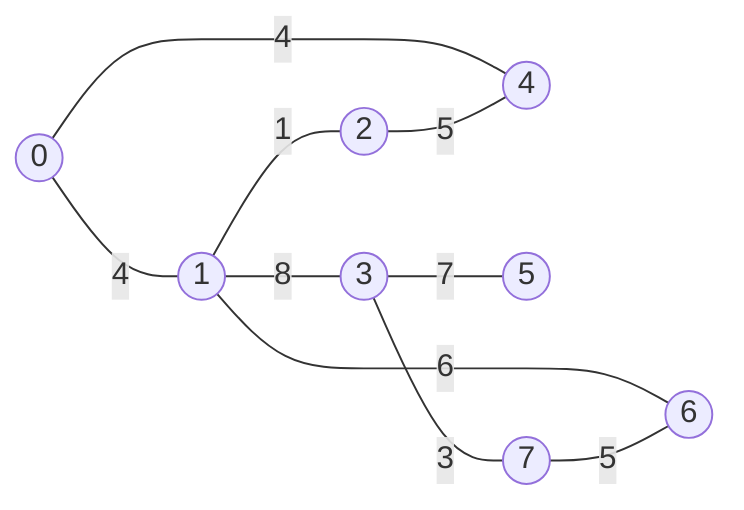

# Algorithms and Data Structures - Kruskal

## Characteristics
- Time complexity: O(V log V)
  - Because sorting the edges by weight is the dominant operation
- Space complexity: O(V + E)

## Demos

[Implementation](./src/kruskal.py)

## References
- [Other Algorithms & Data Structures](https://github.com/NelsonBN/algorithms-data-structures)
